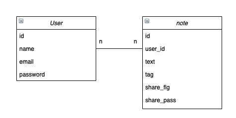

# Free Note

## 概要

文字サイズやフォント、URLなどの余分なものをすべて取り払ったノートアプリ

## Frontend

- [https:github.com/free-note-front](https:github.com/free-note-front)

## 環境

- 動作確認環境

| パッケージ | バージョン |
| -- | -- |
| Ruby | 2.7.1 |
| Rails | 6.0.3 |
| RSpec |  |
| Docker | 20.10.2 |
| docker-compose | 1.27.4 |

## 環境構築

- 初回環境構築
- 起動方法

## テスト(Rspec)

## ER図

